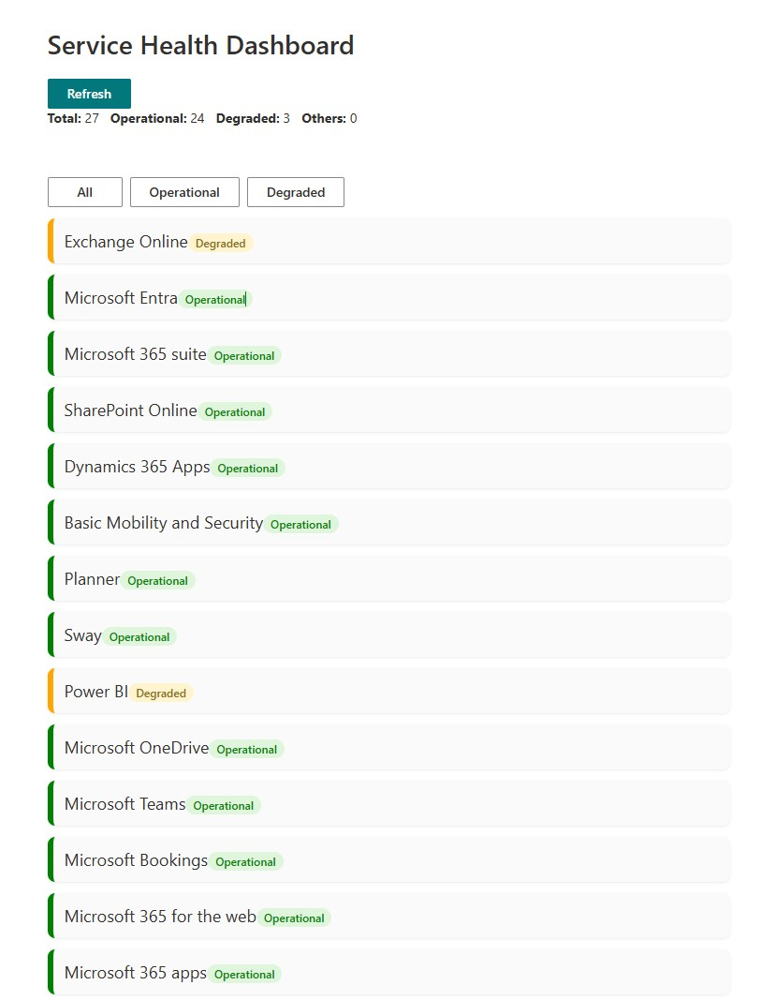
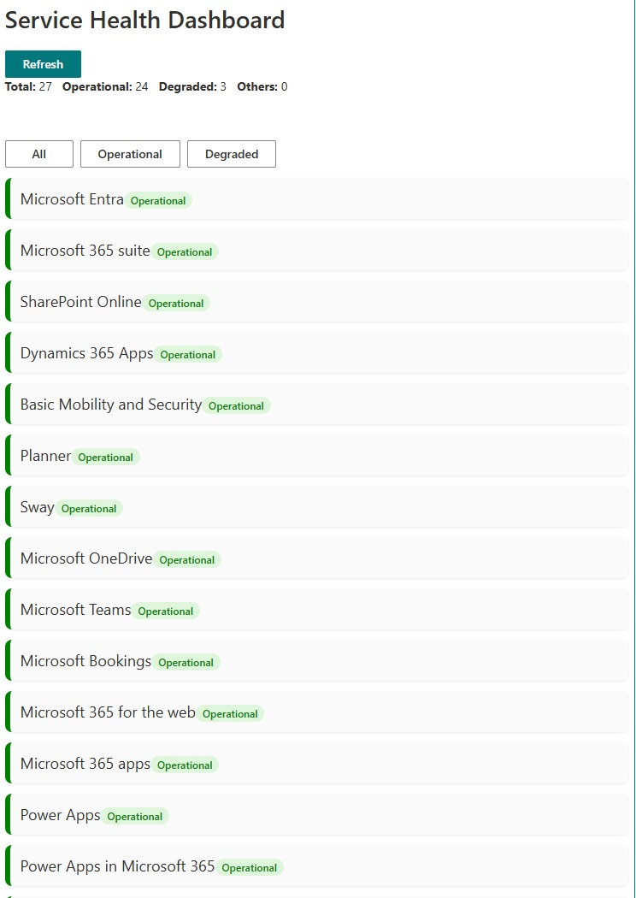
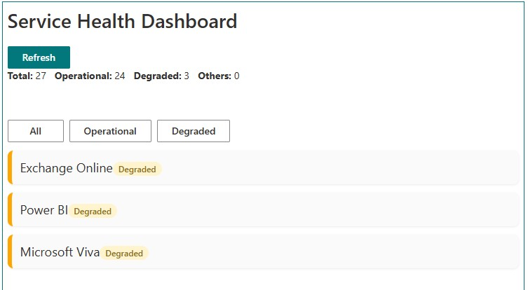
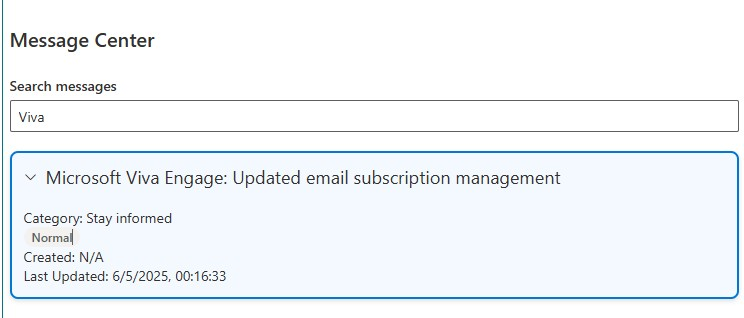
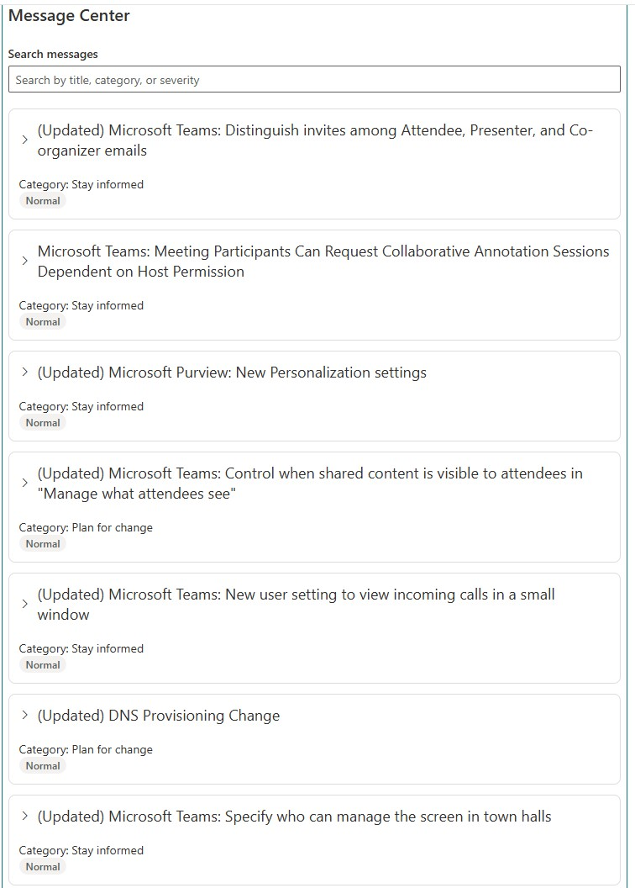

# SPFx M365 Service Health Dashboard

Enterprise-style SharePoint Framework (SPFx) dashboard using Microsoft Graph, Node.js API, and Fluent UI to monitor Microsoft 365 Service Health, service issues, and Message Center announcements.

## Features

- Microsoft 365 Service Health Overview
- Operational / Degraded Service Monitoring
- Related Issue Details by Service
- Message Center Announcements
- Message Search and Filtering
- Service Status Filtering
- Refresh Capability
- Responsive Fluent UI Dashboard
- Microsoft Graph + Express API Integration

---

## Screenshots

### Dashboard Overview



---

### Operational Services View



---

### Degraded Services View



---

### Message Center Search



---

### Message Center Detail View



---

## Tech Stack

- SharePoint Framework 1.22.2
- React
- TypeScript
- Fluent UI
- Microsoft Graph
- Node.js
- Express
- MSAL Authentication

---

## Microsoft Graph Endpoints Used

```http
/admin/serviceAnnouncement/healthOverviews
/admin/serviceAnnouncement/issues
/admin/serviceAnnouncement/messages
/admin/serviceAnnouncement/messages/{id}
```

---

## Architecture

### SPFx Frontend
- Service Health Dashboard UI
- Service Status Cards
- Message Center View
- Issue Details Panel
- Filters and Search

### Node API Backend
- Microsoft Graph Authentication
- Graph Proxy Routes
- Service Health Retrieval
- Message Center Retrieval
- Issue Retrieval

---

## Setup

Clone repository:

```bash
git clone https://github.com/Joce2326/spfx-M365-service-health-dashboard.git
cd spfx-M365-service-health-dashboard
```

Install dependencies:

```bash
npm install
```

Run SPFx:

```bash
gulp serve --nobrowser
```

Run API:

```bash
npm start
```

---

## API Routes

```http
GET /health
GET /health/messages
GET /health/{serviceId}/issues
```

---

## Notes

Create a `.env` file for API secrets:

```env
PORT=3001
TENANT_ID=your-tenant-id
CLIENT_ID=your-client-id
CLIENT_SECRET=your-secret
```

Do not commit `.env`.

---

## Future Improvements

- Service Health Trend Analytics
- AI-assisted Incident Summary
- Severity Filtering
- Teams Notifications
- Historical Outage Reporting

---

## Author

Jocelyn Zavala Fara
